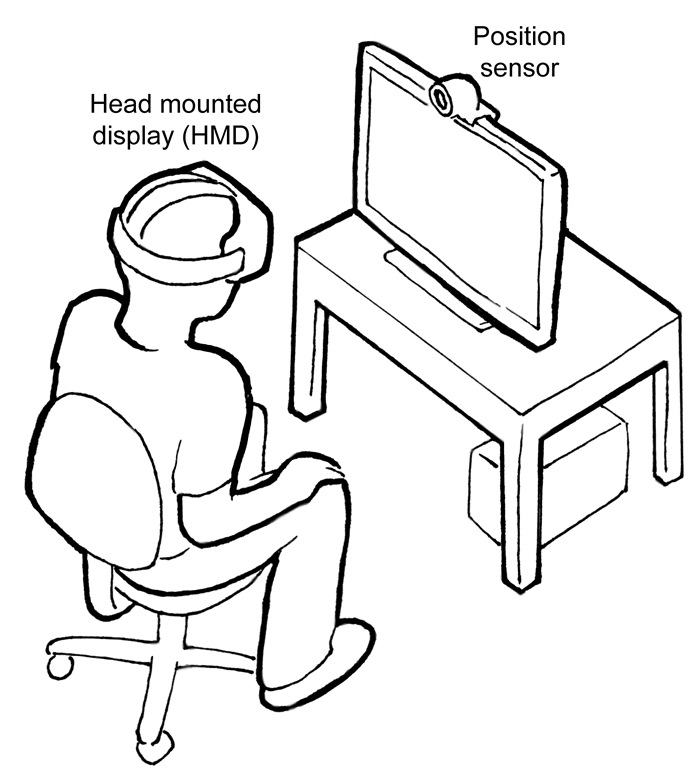

# WebXR-Tutorial

## WebXR

**WebXR** 是一组支持将渲染 3D 场景用来呈现虚拟世界（虚拟现实，也称作 VR）或将图形图像添加到现实世界（增强现实，也称作 AR）的标准。 **WebXR 设备** API 实现了 WebXR 功能集的核心，管理输出设备的选择，以适当的帧速率将 3D 场景呈现给所选设备，并管理使用输入控制器创建的运动矢量。

> WebXR 包含 VR 和 AR

WebXR-兼容性设备包括沉浸式 3D 运动和定位跟踪耳机，通过框架覆盖在真实世界场景之上的眼镜，以及手持移动电话，它们通过用摄像机捕捉世界来增强现实，并通过计算机生成的图像增强场景。

为了完成这些事情，WebXR 设备 API 提供了以下关键功能：

- 查找兼容的 VR 或 AR 输出设备
- 以适当的帧率将 3D 场景渲染到设备
- （可选）将输出镜像到 2D 显示器
- 创建代表输入控件运动的向量

在最基本的层面上，通过计算应用于场景的透视图，以从每个用户的视角呈现场景，从而在 3D 中呈现场景，考虑到眼睛之间的常规距离，然后渲染场景两次，每只眼睛一次。然后将生成的图像 (场景在一个帧上呈现两次，每只眼睛一半) 显示给用户。

由于 [WebGL](https://developer.mozilla.org/zh-CN/docs/Web/API/WebGL_API) 用于将 3D 世界渲染到 WebXR 会话中，因此您首先应该熟悉 WebGL 的一般用法以及 3D 图形的基本知识。您很可能不会直接使用 WebGL API，而是利用在 WebGL 之上构建的框架或库之一来使其使用更加方便。其中最流行的是[three.js](https://threejs.org/)。

使用库而不是直接使用 WebGL API 的一个特殊好处是，库取向于实现虚拟相机函数性的接口。OpenGL（ WebGL 的扩展）不直接提供照相机视图，使用库模拟一个的话可以使您的工作变得非常非常容易，特别是在构建允许在虚拟世界中自由移动的代码时。

## [WebXR 设备 API 的概念和用法](https://developer.mozilla.org/zh-CN/docs/Web/API/WebXR_Device_API#webxr_设备api_的概念和用法)

### [WebXR: AR and VR](https://developer.mozilla.org/zh-CN/docs/Web/API/WebXR_Device_API#webxr_ar_and_vr)

举例 WebXR 硬件装备

较早的 [WebVR API](https://developer.mozilla.org/zh-CN/docs/Web/API/WebVR_API) 仅设计为支持虚拟现实（VR），而 WebXR 在 Web 上同时支持 VR 和增强现实（AR）。WebXR 增强现实模块增加了对 AR 功能的支持。


典型的 XR 设备可以具有 3 或 6 个自由度，并且有没有外部位置传感器都可以。

该设备还可以包括加速度计，气压计或其他传感器，用于感测用户何时在空间中移动，旋转其头部等。

### WebXR 应用程序生命周期

使用 WebXR 的大多数应用程序将遵循类似的总体设计模式：

1. 检查用户的设备和浏览器是否都能够呈现您想要提供的 XR 体验。

   1. 确保 WebXR API 可用；如果 [`navigator.xr`](https://developer.mozilla.org/zh-CN/docs/Web/API/Navigator/xr) 未定义，则可以判断用户的浏览器和/或设备不支持 WebXR。如果不支持，请禁用用于激活 XR 功能的任何用户界面，并中止任何进入 XR 模式的尝试。
   2. 调用 [`navigator.xr.isSessionSupported()`](https://developer.mozilla.org/zh-CN/docs/Web/API/XRSystem/isSessionSupported), 指定要提供的 WebXR 体验模式: `inline`, `immersive-vr`, 或 `immersive-ar`, 以确定您希望提供的会话类型是否可用。
   3. 如果要使用的会话类型可用，请向用户提供适当的界面以允许他们激活它。

2. 当用户通过上述的界面开启了 WebXR 功能后，通过调用 [`navigator.xr.requestSession()`](https://developer.mozilla.org/zh-CN/docs/Web/API/XRSystem/requestSession)，也是指定使用的模式为以下三种之一： `inline`, `immersive-vr`, 或 `immersive-ar`后，可以将一个 [`XRSession`](https://developer.mozilla.org/zh-CN/docs/Web/API/XRSession) 设定在期望的模式下。 

3. 当 

   ```
   requestSession()
   ```

    返回的 promise 被 resolve 后，使用新的 

   `XRSession`

    

   在整个 WebXR 体验期间运行帧循环。

   1. 调用 [`XRSession`](https://developer.mozilla.org/zh-CN/docs/Web/API/XRSession) 的 [`requestAnimationFrame()`](https://developer.mozilla.org/zh-CN/docs/Web/API/XRSession/requestAnimationFrame) 方法，以调度 XR 设备的首帧渲染。
   2. 每一个 `requestAnimationFrame()` 的回调都需要使用 WebGL 渲染已提供信息的 3D 世界中的物体。
   3. 持续在回调中调用 [`requestAnimationFrame()`](https://developer.mozilla.org/zh-CN/docs/Web/API/XRSession/requestAnimationFrame) 保证每一帧都成功地按顺序渲染。

4. 当需要结束 XR 会话的时候；或者用户主动退出 XR 模式。

   1. 通过调用 [`XRSession.end()`](https://developer.mozilla.org/zh-CN/docs/Web/API/XRSession/end) 可手动结束 XR 会话。
   2. 无论通过何种方式（开发者、用户或者浏览器）终止会话，[`XRSession`](https://developer.mozilla.org/zh-CN/docs/Web/API/XRSession) 的 [`end`](https://developer.mozilla.org/zh-CN/docs/Web/API/XRSession/end_event) 事件都会接收到通知。

```
    const canvas = document.createElement('canvas')
    if ("xr" in window.navigator) {
      /* WebXR can be used! */
      console.info('WebXR can be used!')
      const VRDevices =  Navigator.getVRDevices
      console.info('VRDevices', VRDevices)

      // 支持模式判断 inline, immersive-vr, immersive-ar 体验模式, 返回 promise
      navigator.xr.isSessionSupported('inline')
      navigator.xr.isSessionSupported('immersive-vr')
      navigator.xr.isSessionSupported('immersive-ar')

      // 请求开启模式 WebXR 体验期间运行帧循环
      const XR = navigator.xr
      XR.requestSession("inline").then((XRSession) => {
        const gl = canvas.getContext('webgl', { xrCompatible: true })

        const xrReferenceSpace = await XRSession.requestReferenceSpace('viewer')

        const requestHandleId = XRSession.requestAnimationFrame((time, xrFrame) => {
          let session = xrFrame.session;

          let pose = xrFrame.getViewerPose(xrReferenceSpace)

          if (pose) {
            let xrWebGLLayer = session.renderState.baseLayer;
            gl.bindFramebuffer(xrWebGLLayer.framebuffer)

            for (xrView of pose.views) {
              let xrViewport = xrWebGLLayer.getViewport(xrView)
              gl.viewport(xrViewport.x, xrViewport.y,
                          xrViewport.width, xrViewport.height)
            }
          }
        })

        // XRSession.cancelAnimationFrame(requestHandleId)
        // XRSession.end()
      })

    } else {
      /* WebXR isn't available */
      console.info("WebXR isn't available")
    }
```

### [获取许可与安全性](https://developer.mozilla.org/zh-CN/docs/Web/API/WebXR_Device_API#获取许可与安全性)

WebXR Device API 受到一系列许可与安全性的控制。这些控制不涉及法律责任，但也需要引起重视。其控制场景主要在于身临其境的 `immersive-vr` 会话模式和 AR 会话下。

#### VR 的沉浸式（immersive）

首先，如果域名不支持请求有权限打开沉浸模式，那么 `immersive-vr` 模式就会被拒绝。这个权限管理来自`xr-spatial-tracking` [特征策略](https://developer.mozilla.org/zh-CN/docs/Web/HTTP/Feature_Policy)。

一旦有权限了，申请开启 `immersive-vr` 模式的请求还需要再检查以下三点，全部满足才能开启：

- 在用户事件句柄总或者在用户启动 [web 应用](https://developer.mozilla.org/zh-CN/docs/Web/Progressive_web_apps)中执行的 `requestSession()` 调用；
- 文档是可信赖的，其中的内容是可靠的、及时更新的以及有着重点；
- 用户有明确的使用沉浸式 VR 模式的意图，后文中，[用户意图](https://developer.mozilla.org/zh-CN/docs/Web/API/WebXR_Device_API#用户意图)一节将有详细描述。

如果上述三点均满足， `requestSession()` 返回的 Promise 将被 resolve，新的 [`XRSession`](https://developer.mozilla.org/zh-CN/docs/Web/API/XRSession) 对象被传入完成时的处理函数中。如果有不满足的情况，将会根据具体场景抛出异常，比如当没有权限进入沉浸式模式情况下， `SecurityError` 将被抛出。

#### 内联（inline）

当你在 `inline` 模式下发出 [`XRSession`](https://developer.mozilla.org/zh-CN/docs/Web/API/XRSession) 请求想要请求其他的特性时，浏览器仅允许那些明显由**用户意图**发起才会执行的代码所调用到的 [`requestSession()`](https://developer.mozilla.org/zh-CN/docs/Web/API/XRSystem/requestSession)。

特别注意：

- 如果 `requestSession()` 调用的发起既不来自用户事件中，也不是在 Web 应用启动时，那该请求将会被驳回，Promise 放返回 `false`;
- 如果发起请求的文档不属于对应的脚本，该请求将被驳回；
- 如果发起请求的文档不可信任，该请求会被驳回且 Promise 返回 `false`。一个可信任文档指的是该文档是活跃的、负责任的且有重点的；
- 如果设备无法明确用户开启内联模式的意图，该请求将会被驳回。对[用户的目的](https://developer.mozilla.org/zh-CN/docs/Web/API/WebXR_Device_API#用户意图)的理解可以是隐性或者显性的。

**注意**：当调用 `requestSession()` 时，根据选择对象需要指定的特性不同，将会执行额外的请求。

#### 用户意图

**用户意图**指的是用户自身是否想执行某个动作的时候可以通过代码控制实际的执行情况。有两种用户意图类型：**显性**和**隐性**。

直接询问用户是否同意执行某个操作，即**显性的用户意图** (用户显示的同意操作) 。


## 重要的健康和安全提示

因为本质上来说，创建虚拟 3D 世界的整个过程是一个技巧，它利用了我们对眼睛如何收集光以及大脑如何解释所收集的数据的理解，因此务必要牢记，软件设计师开发人员有责任比平时更加小心，以确保结果正确。

缺陷，未对准或变形会混淆眼睛和大脑，导致眼睛疼痛或头痛乃至眩晕，头晕或潜在的严重恶心。考虑到 VR 护目镜的全部特性，需要特别注意，开发者对可能引起癫痫发作的任何事物都要保持警惕；如果它引起困扰，则用户可能无法快速将视线从您呈现的图像上移开。

如果您有任何可能对任何用户构成风险的内容，则应提供警告消息。有备无患！


## References

[WebXR Device API Specification](https://github.com/immersive-web/webxr)

[WebXR Polyfill](https://github.com/immersive-web/webxr-polyfill)

[webxr-samples](https://github.com/immersive-web/webxr-samples)

[WebXR 设备 接口参考](https://developer.mozilla.org/zh-CN/docs/Web/API/WebXR_Device_API)

[WebXR Device API](https://immersive-web.github.io/webxr/)

[【WebAR】虚拟现实来到网页——WebXR Device API的基础知识](https://zhuanlan.zhihu.com/p/131596282?utm_source=wechat_session&utm_medium=social&utm_oi=54749781032960)
